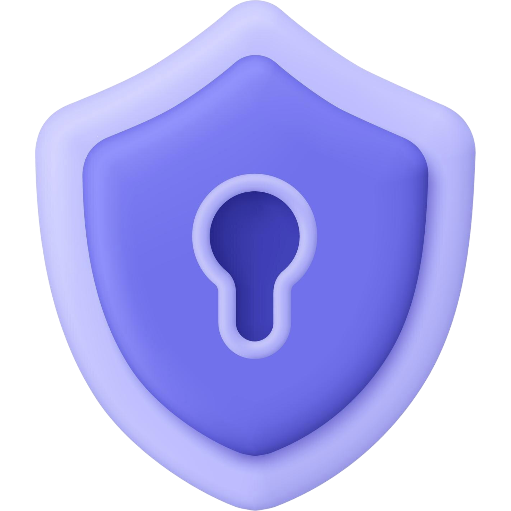

<div align="center">
  
  
  # Simple Password Manager

  **A modern, secure, KeePass-compatible password manager built with Tauri, Rust, and Next.js**

  [](LICENSE)
  [](https://tauri.app)
  [](https://nextjs.org)
  [](https://rust-lang.org)

</div>

---

## Overview

Simple Password Manager is a lightweight, cross-platform desktop application for managing your passwords securely. It's fully compatible with KeePass databases (KDBX 3 & 4), allowing you to use your existing password vaults or create new ones.

Built with privacy in mind: **100% offline, no cloud sync, no telemetry** – your passwords never leave your device.

## Features

| Feature | Description |
|---------|-------------|
| ✅ **KeePass Compatible** | Full read/write support for KDBX 3 & 4 databases |
| 🔒 **Secure & Local** | No cloud, no telemetry – battle-tested AES-256 encryption |
| 🎨 **Modern UI** | Clean, intuitive interface with light/dark theme support |
| 🔍 **Instant Search** | Find entries quickly across your entire database |
| 🔑 **Password Generator** | Generate strong, customizable passwords |
| ⭐ **Favorites** | Mark frequently used entries for quick access |
| 📋 **Auto-Clipboard Clear** | Passwords automatically cleared after 30 seconds |
| 📁 **Drag & Drop** | Organize entries and groups intuitively |
| 🖼️ **69 Built-in Icons** | Choose from the full set of KeePass icons |
| 💾 **State Persistence** | Remembers expanded folders per database |
| 🖱️ **Context Menus** | Right-click anywhere for quick actions |
| 🪟 **Multi-Window Editing** | Edit entries in separate windows |
| 🔐 **Auto-Lock** | Configurable auto-lock after inactivity |
| 🚀 **Quick Unlock** | Fast re-authentication for recently opened databases |
| 📎 **File Association** | Double-click `.kdbx` files to open directly |
| 🌍 **Cross-Platform** | Windows, macOS, and Linux support |

## Tech Stack

| Layer | Technologies |
|-------|--------------|
| **Frontend** | Next.js 16, React 19, TypeScript, Tailwind CSS, shadcn/ui, dnd-kit |
| **Backend** | Tauri 2.0, Rust, keepass, secrecy |
| **Icons** | Lucide React + 69 KeePass built-in icons |

## Installation

### Prerequisites

- **Node.js** v20+ and **npm** v10+
- **Rust** (latest stable via [rustup](https://rustup.rs/))

**Platform-specific requirements:**

| Platform | Requirements |
|----------|--------------|
| Windows | Visual Studio C++ Build Tools, WebView2 |
| macOS | Xcode Command Line Tools |
| Linux | webkit2gtk, build-essential ([Tauri prerequisites](https://v2.tauri.app/start/prerequisites/)) |

### Build from Source

```bash
# Clone the repository
git clone https://github.com/jonax1337/Password-Manager.git
cd Password-Manager

# Install dependencies
npm install

# Run in development mode
npm run tauri:dev

# Build for production
npm run tauri:build
```

Production builds are located in `src-tauri/target/release/bundle/`

## Usage

### Getting Started

1. **Open or Create Database**: Launch the app and either open an existing `.kdbx` file or create a new database
2. **Enter Master Password**: Your master password is the only key to your vault – remember it!

### Managing Entries

| Action | How to |
|--------|--------|
| **Create Entry/Group** | Click the `+` button or right-click for context menu |
| **Edit Entry** | Double-click an entry or right-click → Edit |
| **Move Items** | Drag entries between groups, drag groups to reorder |
| **Copy Credentials** | Click copy icons next to username/password fields |
| **Mark Favorite** | Star icon on entries for quick access |

### Keyboard Shortcuts

| Shortcut | Action |
|----------|--------|
| `Ctrl/Cmd + S` | Save database |
| `Enter` | Unlock database (on login screen) |

### Settings

- **Auto-Lock**: Configure automatic locking after inactivity
- **Close to Tray**: Minimize to system tray instead of closing
- **Theme**: Toggle between light and dark mode

## Security

| Measure | Implementation |
|---------|----------------|
| **Encryption** | AES-256 via keepass library |
| **Memory Safety** | Rust backend with `secrecy` crate for secret handling |
| **Clipboard Protection** | Auto-clears copied passwords after 30 seconds |
| **No Logging** | Sensitive data is never logged |
| **Offline Only** | Zero network calls – 100% local operation |

### Code Signing

For production releases, code signing is supported to prevent operating system security warnings:
- **Windows**: Authenticode signing with code signing certificates
- **macOS**: Developer ID signing and notarization
- **Linux**: GPG signing for release artifacts

See the [Code Signing Guide](docs/SIGNING.md) for setup instructions.

## Project Structure

```
password-wallet/
├── app/                    # Next.js pages and layouts
│   ├── entry/             # Entry editor page
│   └── settings/          # Settings page
├── components/            # React components
│   └── ui/               # shadcn/ui components
├── lib/                   # Utility functions and helpers
├── public/                # Static assets
└── src-tauri/             # Tauri/Rust backend
    └── src/
        ├── main.rs        # Tauri entry point
        ├── kdbx.rs        # KeePass database operations
        └── commands.rs    # Tauri command handlers
```

## Disclaimer

> ⚠️ **This software has not undergone a professional security audit.** Use at your own risk. For mission-critical password management, consider established solutions like [KeePass](https://keepass.info/) or [KeePassXC](https://keepassxc.org/).

This project is not affiliated with or endorsed by the official KeePass project.

## Contributing

Contributions are welcome! Feel free to open issues or submit pull requests.

## Author

**Jonas Laux**

## License

MIT License – See [LICENSE](LICENSE) file for details
